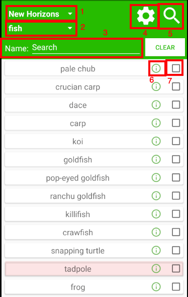
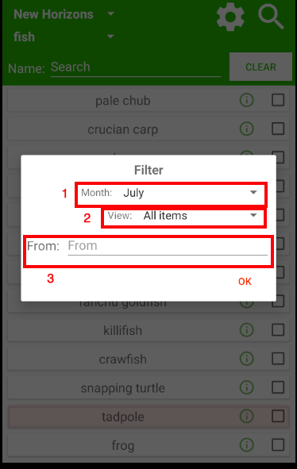
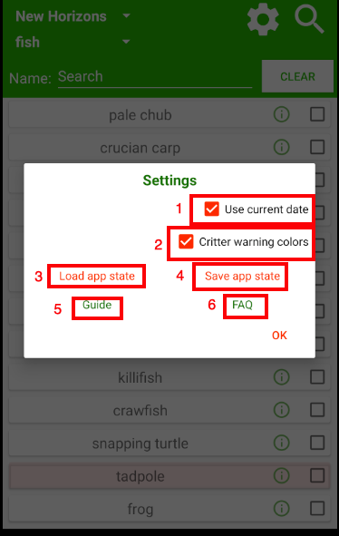

# Animal Crossing Catalog for Android
Android version of Animal Crossing Catalog

Contact: abw4v.dev@gmail.com

Play Store: https://play.google.com/store/apps/details?id=com.abw4v.accatalog

# News

## 9/4/2022: This app is no longer supported! Use the newer (cross-platform) version here: https://github.com/armlesswunder/accFlutter/releases

1/12/22: Update 2.0 is now live. All items in new horizons are up to date. Variations which Cyrus may customize have been removed, thus, the old save states are no longer valid. Please ensure you create new backups ASAP.

Please consider donating to me https://gofund.me/e6fc7138

All of the content I have made is free, but if you wish to show your appreciation for my content, this is perhaps the best way to do it!

7/28/21: I've added an apk here (under releases) so that users may bypass the app store. 

# Credits
Special thanks to Nintendo, Liquify (For all games catalog reference, except ACNH), http://moridb.com/(ACNL Welcome Amiibo items reference), and everyone who contributed to the data sheet available at Nookazon (For ACNH reference) for making all this possible!

# Want to use the app on desktop?
Please checkout bluestacks.com and download the app on the emulator.

# Guide

1) Game selector
2) Item type selector
3) Searchbar
4) Settings
5) Filter
6) Extra info button
7) Checkbox

## Game selector
Appears in the top left of the main screen. Use this to change which games item lists you are viewing. 
Supports main series games: 
Gamecube, WildWorld, City Folk, New Leaf, and New Horizons.

## Item type selector
Appears under game selector. Use this to change what items you are viewing. Each game has different item types and are mostly complete. Please email me if you want an item type added and I will probably do it for you.

## Searchbar
Use the searchbar to search for items by name. 

When you type into the searchbar, all items with names that do not include the text you typed are excluded from your list. There is no search button, everything happens as you are typing so that this is a quick process. Searchbar works in conjucnction with all filter choices as well.

## Filter (magnifying glass)
Appears on the top right of top bar. Pressing this opens a dialog with several options so that you can filter which items appear in the item list.

1) Month
2) View
3) From

### Month
This option only appears when you are viewing fish/bugs/sea creatures. It will make it to where only critters available in the month you have chosen (whether you know you chose it or not) will appear in the list of critters you are viewing. 
This option can be chosen automatically for you if you use the setting "use current date". 

### View
*Options*
All items: view items regardless of whether they are checked. (default)
Checked items: view checked items only
Unchecked items: view unchecked items only

### From
Search for items based on where the item is from. 

This one is a little advanced, but quite useful when searching from items from a specific source. (eg: nooks, ables, sahara...) It works exactly like the searchbar for item names except it filters items by where they are from.

### Item name
The name of the item as it appears in your inventory. May contain the variation of the item for new horizons.

### Extra info button
Press this to reveal additional info about the item. (price, from, style, etc...)

*Price for some items may be the selling price if the item is unorderable. *

All items in the same list have the same infos, but each list is different. 

### Checkbox
Check items off your list. Your selection is saved as soon as you do it.

## Settings
Run-of-the-Mill app settings

1) Use current date
2) Critter warning colors
3) Load app state
4) Save app state
5) Guide
6) FAQ

### Use current date
Looks at your phones date to determine what month it is. That month is then used to display only critters available in that month by default. You can still change the month in filter to look up facts quickly.
Default unchecked (updated in 1.4 since so many people are confused by this).

### Critter warning colors
Changes item background to red, if the critter is gone next month, or or green, if the critter wasn't in the previous month.

### Load app state
Load a backup of your checklist data.

Backups only attempt to check items, it will never erase items you have checked. It is safe to rename the file to whatever you want.

*If you edit your backup data files contents and you break everything, don't complain about it to me.
The file is saved as a sql file. If you know sql, you could load some crazy (or useful) stuff into this app. 
Again, I'm not responsible for what you do with your file*

### Save app state
Create a backup of your checklist data.

### Guide
Brings you here!

# FAQ

## Q: This app is missing a bunch of fish/bugs/sea creatures.
A: You are using the filter feature for displaying only fish/bugs/sea creatures available during a certain month. You can change the month selected in the filter settings (magnifying glass). You can enable/disable 'use current month' in the app settings (gear icon). 

If you post negative reviews because you haven't tested this feature, please remove them. If you have tested this feature and you hate it, please discuss that in your review.

## Q: This app has way to many items, it would be so much easier to find what I am looking for if there was some way to filter items.

A: There is no lack of filtering options in this app. Learn to use the searchbar, filter settings, and month settings for critters.
https://github.com/armlesswunder/android_ac_catalog/blob/master/README.md#searchbar
https://github.com/armlesswunder/android_ac_catalog/blob/master/README.md#filter-magnifying-glass
https://github.com/armlesswunder/android_ac_catalog/blob/master/README.md#month
